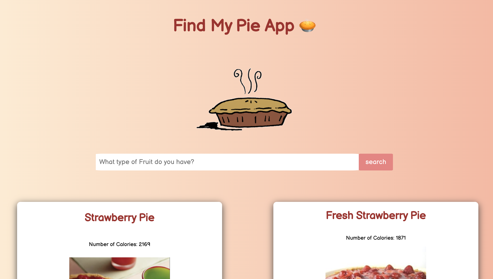
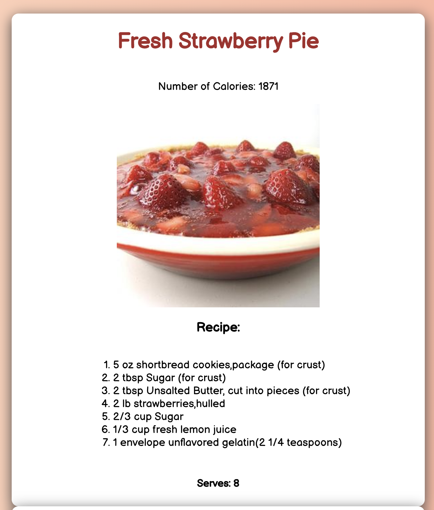

# Find My Pie App

## About This Application
This React.js Web Application was bootstrapped with Create React App.
The purpose was to allow the user to enter the name of a fruit they have at home,
and then the external API call from Edaman will load in 10 pie-related recipes
according to the fruit the user typed in!

## About This Application
I learned about importing images and requiring them, reusable components, CSS modules specific to a component,
naming conventions for classes, using State and lifting State as well.

## Project on Heroku
The project is hosted on Heroku via: [this link](https://find-my-pie-app.herokuapp.com/)

## Main Search Bar

## Recipe Card

## Available Scripts

In the project directory, you can run:

### `npm start`

Runs the app in the development mode. 
Open [http://localhost:3000](http://localhost:3000) to view it in the browser.

The page will reload if you make edits. 
You will also see any lint errors in the console.
